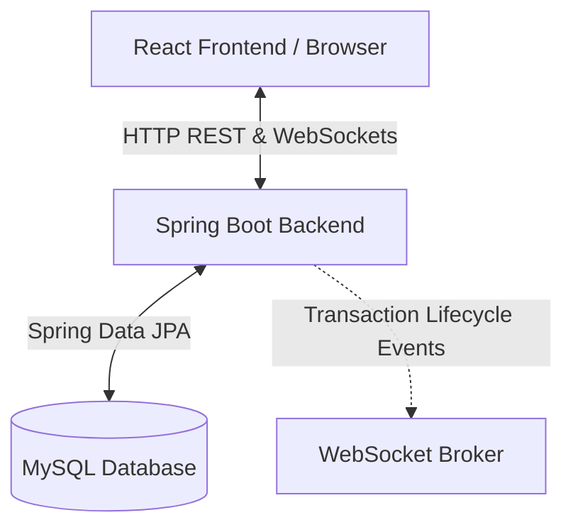

# Event Management System (EMS) — Complete System Documentation

Welcome to the comprehensive documentation of the **Event Management System (EMS)**. This document covers the architecture, backend structure, frontend structure, database models, real-time features, API reference, and setup guide for the application.

---

## 📖 Table of Contents
1. [System Overview](#1-system-overview)
2. [System Architecture](#2-system-architecture)
3. [Database Schema & Data Model](#3-database-schema--data-model)
4. [Backend API Reference](#4-backend-api-reference)
5. [WebSockets & Real-time Features](#5-websockets--real-time-features)
6. [Frontend Architecture & Pages](#6-frontend-architecture--pages)
7. [Local Setup & Execution Guide](#7-local-setup--execution-guide)

---

## 1. System Overview

The **Event Management System (EMS)** is a full-stack platform designed for managing college/university cultural and technical events, business summits, workshops, and concerts. It serves three user roles:
*   **ADMIN**: Full administrative control over categories, venues, events, bookings, and the check-in console.
*   **ORGANIZER**: Responsible for setting up events, configuring layouts, reviewing bookings, managing sponsors, and hosting real-time interactive rooms.
*   **USER / ATTENDEE**: Browses events, books tickets, accesses their ticketing QR-code/Token, answers live polls, submits questions in the Q&A section, and interacts with sponsors.

---

## 2. System Architecture

The application is split into a Java-based REST & WebSocket backend and a modern React-based Single Page Application (SPA) frontend.



### Backend Tech Stack
*   **Language & Framework**: Java 17, Spring Boot 3
*   **Security**: Spring Security 6 (Stateless Session, JWT Authenticated)
*   **Database Access**: Hibernate / Spring Data JPA
*   **Messaging**: Spring WebSocket Messaging (`SimpleBroker` over STOMP / SockJS)
*   **Build Tool**: Maven

### Frontend Tech Stack
*   **Core Library**: React 18, Vite
*   **Routing**: React Router DOM v6
*   **Styling**: CSS (TailwindCSS/Vanilla CSS modules)
*   **State Management**: React Context API
*   **API Client**: Axios (with interceptors for JWT injection and auth-expiration handling)
*   **Real-time Connection**: SockJS & `@stomp/stompjs`

---

## 3. Database Schema & Data Model

The database is built on a relational MySQL structure. The schema includes the following tables:

### 3.1 Table definitions

#### `roles`
Stores role templates mapping to system access profiles.
*   `id` (BIGINT, PK, AUTO_INCREMENT)
*   `name` (VARCHAR(50), UNIQUE, NOT NULL): `ADMIN`, `ORGANIZER`, `USER`
*   `created_at`, `updated_at` (DATETIME)

#### `users`
Stores credentials, contacts, and state.
*   `id` (BIGINT, PK, AUTO_INCREMENT)
*   `full_name` (VARCHAR(150), NOT NULL)
*   `email` (VARCHAR(120), UNIQUE, NOT NULL)
*   `phone_number` (VARCHAR(20), UNIQUE, NOT NULL)
*   `password` (VARCHAR(255), BCrypt encrypted, NOT NULL)
*   `profile_image` (VARCHAR(255))
*   `enabled` (BOOLEAN, DEFAULT TRUE)
*   `created_at`, `updated_at` (DATETIME)

#### `user_roles`
Join table establishing a `@ManyToMany` relationship between `users` and `roles`.
*   `user_id` (BIGINT, FK referencing `users.id`)
*   `role_id` (BIGINT, FK referencing `roles.id`)

#### `categories`
Stores event categories.
*   `id` (BIGINT, PK, AUTO_INCREMENT)
*   `category_name` (VARCHAR(100), UNIQUE, NOT NULL)
*   `description` (VARCHAR(255))

#### `venues`
Physical locations where events take place.
*   `id` (BIGINT, PK, AUTO_INCREMENT)
*   `venue_name` (VARCHAR(150), NOT NULL)
*   `address` (VARCHAR(255), NOT NULL)
*   `city` (VARCHAR(100), NOT NULL)
*   `state_name`, `country` (VARCHAR(100))
*   `capacity` (INT)
*   `contact_person` (VARCHAR(100)), `contact_phone` (VARCHAR(20))

#### `events`
Details of scheduled fests, conferences, or workshops.
*   `id` (BIGINT, PK, AUTO_INCREMENT)
*   `event_title` (VARCHAR(150), NOT NULL)
*   `description` (TEXT)
*   `event_date` (DATE, NOT NULL)
*   `start_time` (TIME, NOT NULL)
*   `end_time` (TIME)
*   `ticket_price` (DECIMAL(10,2), NOT NULL)
*   `total_seats` (INT, NOT NULL)
*   `available_seats` (INT, NOT NULL)
*   `banner_url` (VARCHAR(255))
*   `event_status` (VARCHAR(50), NOT NULL): `UPCOMING`, `ONGOING`, `COMPLETED`, `CANCELLED`
*   `category_id` (BIGINT, FK referencing `categories.id`)
*   `venue_id` (BIGINT, FK referencing `venues.id`)
*   `organizer_id` (BIGINT, FK referencing `users.id`)

#### `bookings`
Ticketing records representing seat reservation and attendance logs.
*   `id` (BIGINT, PK, AUTO_INCREMENT)
*   `token_id` (VARCHAR(50), UNIQUE) — used for QR code generation & secure scanning check-ins.
*   `number_of_tickets` (INT, NOT NULL)
*   `total_amount` (DECIMAL(10,2), NOT NULL)
*   `booking_time` (DATETIME, NOT NULL)
*   `booking_status` (VARCHAR(50), NOT NULL): `CONFIRMED`, `CANCELLED`, `PENDING`
*   `payment_status` (VARCHAR(50)): `PAID`, `PENDING`
*   `checked_in` (BOOLEAN, DEFAULT FALSE)
*   `check_in_time` (DATETIME)
*   `user_id` (BIGINT, FK referencing `users.id`)
*   `event_id` (BIGINT, FK referencing `events.id`)

#### `sponsor_booths`
Represents interactive sponsor stalls configured for events.
*   `id` (BIGINT, PK, AUTO_INCREMENT)
*   `company_name` (VARCHAR(150), NOT NULL)
*   `booth_number` (VARCHAR(50), NOT NULL)
*   `logo_url` (VARCHAR(255))
*   `booth_traffic` (INT, DEFAULT 0)
*   `lead_count` (INT, DEFAULT 0)
*   `booked_by_user_id` (BIGINT)

#### `referral_links`
Tracks affiliate traffic and commission earned for events.
*   `id` (BIGINT, PK, AUTO_INCREMENT)
*   `referral_code` (VARCHAR(50), UNIQUE, NOT NULL)
*   `referrer_id` (BIGINT, FK referencing `users.id`)
*   `clicks` (INT, DEFAULT 0)
*   `conversions` (INT, DEFAULT 0)
*   `commission_earned` (DECIMAL(10,2), DEFAULT 0.00)

---

## 4. Backend API Reference

All backend API request endpoints are prefixed with `/api`. Security configurations restrict certain paths based on roles.

### 4.1 Authentication & Profile (`/api/auth`)
*   `POST /api/auth/register`: Create user account. Returns success message.
*   `POST /api/auth/login`: Authenticate credentials. Returns `{ token, user }` where `user` contains id, email, fullName, and roles.

### 4.2 Events (`/api/events`)
*   `GET /api/events`: Retreive list of all events. *(Public)*
*   `GET /api/events/{id}`: Fetch single event description. *(Public)*
*   `POST /api/events`: Add new event. *(Admin/Organizer only)*
*   `PUT /api/events/{id}`: Modify event details. *(Admin/Organizer only)*
*   `DELETE /api/events/{id}`: Delete event. *(Admin/Organizer only)*

### 4.3 Bookings (`/api/bookings`)
*   `POST /api/bookings`: Create booking reservation. *(Public)*
*   `GET /api/bookings`: Fetch all bookings. *(Admin/Organizer only)*
*   `GET /api/bookings/user/{userId}`: Fetch all bookings for a user. *(Authenticated owner/Admin)*
*   `GET /api/bookings/{id}`: Get detail of a booking by ID. *(Authenticated owner/Admin)*
*   `PUT /api/bookings/cancel/{bookingId}`: Cancel ticket. *(Authenticated owner)*
*   `PUT /api/bookings/{id}/check-in`: Toggle booking check-in state. *(Admin/Organizer only)*

### 4.4 Engagement (`/api/engagement`)
*   `GET /api/engagement/polls/{eventId}`: Fetch all polls for an event.
*   `POST /api/engagement/polls`: Create a poll. *(Admin/Organizer)*
*   `POST /api/engagement/polls/submit`: Submit user vote on active poll.
*   `GET /api/engagement/polls/results/{pollId}`: View vote summaries.
*   `PUT /api/engagement/polls/close/{pollId}`: Deactivate poll.
*   `GET /api/engagement/qnas/{eventId}`: Get Q&A questions (ordered by upvotes).
*   `POST /api/engagement/qnas`: Submit question.
*   `PUT /api/engagement/qnas/upvote/{qnaId}`: Upvote question.
*   `PUT /api/engagement/qnas/answer/{qnaId}`: Mark question as answered.

### 4.5 Sponsors & Referrals
*   `GET /api/sponsors/booths`: Retrieve all booths.
*   `POST /api/sponsors/booths`: Create a booth.
*   `PUT /api/sponsors/booths/book/{boothId}`: Book booth.
*   `PUT /api/sponsors/booths/traffic/{boothId}`: Increment booth visitor count.
*   `PUT /api/sponsors/booths/leads/{boothId}`: Increment lead count.
*   `GET /api/referrals/user/{userId}`: Get referral code / data.
*   `POST /api/referrals`: Generate referral code.
*   `PUT /api/referrals/click/{code}`: Increment code click traffic.
*   `PUT /api/referrals/convert/{code}`: Increment conversions and calculate commission (10% standard rate).

---

## 5. WebSockets & Real-time Features

Real-time notifications and statistics are handled through standard STOMP over WebSockets.

### 5.1 Connection Parameters
*   **WebSocket Endpoint**: `/ws` (supports Fallback to SockJS if standard WebSockets are disabled).
*   **Security**: Authentication is verified on the connection handshake by extracting the `Bearer` token from the standard `Authorization` connect header.

### 5.2 Broadcast Channels (Topics)
Clients can subscribe to the following channels to receive live updates:

1.  **`/topic/events` & `/topic/events/{eventId}`**:
    *   Fires when an event's active status changes, or when tickets are booked (causing seat availability decrement).
    *   *Payload structure*: `{ eventId, availableSeats, eventStatus }`
2.  **`/topic/bookings/{userId}`**:
    *   Notifies specific users when their pending bookings are confirmed or cancelled.
    *   *Payload structure*: `{ bookingId, status }`
3.  **`/topic/admin/dashboard`**:
    *   Broadcasts live KPI statistics to the admin overview dashboard panel.
    *   *Payload structure*: `{ totalBookings, totalRevenue, confirmedBookings, cancelledBookings }`

### 5.3 Transactional Safety (Phase A6)
To avoid broadcasting incorrect states if a database write rolls back, real-time broadcasts use `@TransactionalEventListener` with `phase = TransactionPhase.AFTER_COMMIT`. Updates are sent **only after** the Spring database transaction successfully commits.

---

## 6. Frontend Architecture & Pages

The frontend structure splits the components into logical sections for routing, protected views, public storefronts, and utility integrations.

### 6.1 Directory Map
```
src/
├── api/          # Axios instance and separate modules for each API domain
├── components/   # Layout elements (Public, Dashboard) and common widgets (Spinners)
├── context/      # AuthContext for token and role validation state
├── hooks/        # Custom React hooks (e.g. useAuth)
├── pages/
│   ├── auth/     # LoginPage, RegisterPage
│   ├── dashboard/# Admin/Organizer control panels (Events, Venues, CheckIn, Engagement)
│   └── public/   # Browse events, Homepage, My Bookings
├── realtime/     # socket.js wrapper defining the SocketService client interface
└── routes/       # ProtectedRoute and RoleProtectedRoute wrappers
```

### 6.2 Routes & Page Visibility

*   **Public Access**:
    *   `/` (Root Landing): Redirects to `/dashboard` if logged in, otherwise redirects to `/register`.
    *   `/browse`: Browses all active events.
    *   `/events/:id`: View specific details of an event.
*   **Protected Access (Any Authenticated User)**:
    *   `/my-bookings`: Lists tickets reserved by the user. If unauthenticated, redirected to `/login`.
    *   `/dashboard`: High-level landing showing KPI widgets or personal statistics.
*   **Restricted Access (ADMIN / ORGANIZER Roles)**:
    *   `/dashboard/events`: Event Creation and Status management.
    *   `/dashboard/categories`: Categories CRUD console.
    *   `/dashboard/venues`: Venues CRUD panel.
    *   `/dashboard/bookings`: Booking overview list.
    *   `/dashboard/check-in`: **Check-In Console** allowing real-time booking search and manual/QR check-in.
    *   `/dashboard/engagement`: **Engagement Room** for launching session polls and answering live Q&A.
    *   `/dashboard/venue-map`: Visual seat map and booth mapping tool.
    *   `/dashboard/marketplace`: **Sponsor Hub** where sponsor booths can be updated or booked.

---

## 7. Local Setup & Execution Guide

Follow these exact steps to run both services on your local environment.

### 7.1 Prerequisite Configurations

#### Database Setup
1. Create a MySQL database named `event_management_db`.
2. Seed the tables by running the SQL script: `schema_seed.sql` inside the root folder.

#### Backend Properties
Verify your configuration profiles under `src/main/resources/`. Create or edit `application-dev.properties` to specify your local database credentials:
```properties
spring.datasource.username=YOUR_MYSQL_USERNAME
spring.datasource.password=YOUR_MYSQL_PASSWORD
JWT_SECRET=EFihITg9SNyP5tBGTkyUMhgq3yvq8UcZFEP38N+4iok=
```

#### Frontend Environment variables
Inside `event-management-frontend/`, configure `.env.local`:
```env
VITE_API_BASE_URL=http://localhost:8080/api
VITE_WS_URL=http://localhost:8080/ws
```

---

### 7.2 Run Commands

#### Starting Backend (Spring Boot)
Run this command from the project root. On Windows (PowerShell), make sure to quote the `-D` parameter:
```powershell
.\mvnw.cmd spring-boot:run "-Dspring-boot.run.profiles=dev"
```

#### Starting Frontend (Vite)
Open a new terminal session, navigate to the frontend directory, and launch:
```bash
cd event-management-frontend
npm run dev
```

*Vite will default to `http://localhost:5173`. If port 5173 is already in use, it will automatically start on `http://localhost:5174`.*
